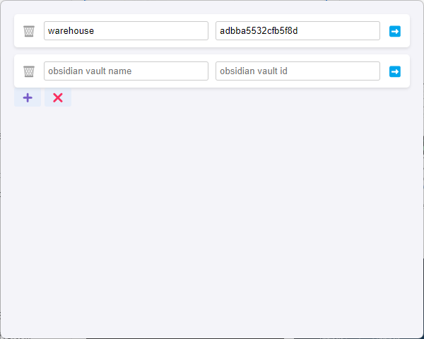

# Eagle-Obsidianbridge
Use with plugin Eagle-ObsidianBridge to realize faster search based on eagle file id jump to obsidian.

 

## Installation
Go to [Eagle-Obsidianbridge/releases](https://github.com/zyjGraphein/Eagle-Obsidianbridge/releases), download `Eagle-ObsidianBridge.eagleplugin` and drag it into eagle to install it.

## Usage
Run the plugin on the image email to enable retrieving the ID of the image in obsidian.
The configuration page is shown in the figure. 

Click on '➕' to add a repository address

Click on '❌' to exit the plugin

Click on '🗑️' to delete a repository address

Click on '➡️' to jump to obsidian for searching

Enter the name of the repository in "obsidian vault name"

Enter the warehouse id in "obsidian vault id" (you need to find your warehouse id in obsidian)

## Note
This plugin is designed for use with [Eagle](https://en.eagle.cool) and should be installed within the Eagle app.  
It works in conjunction with the [Obsidian-EagleBridge](https://github.com/zyjGraphein/Obsidian-EagleBridge) plugin on [Obsidian](https://obsidian.md/).
## Credits
This plugin also utilizes API calls from [Eagle Plugin API](https://developer.eagle.cool/plugin-api).
